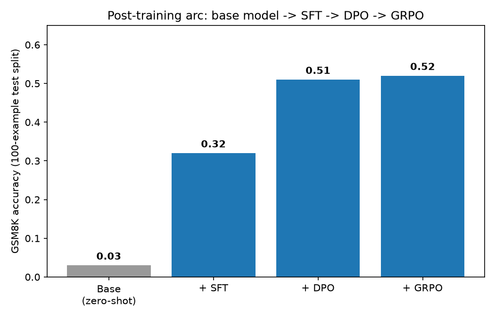
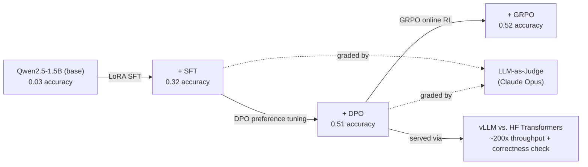
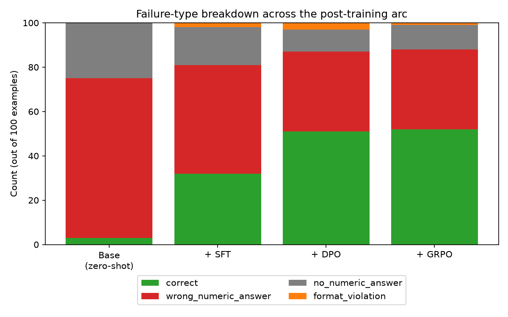
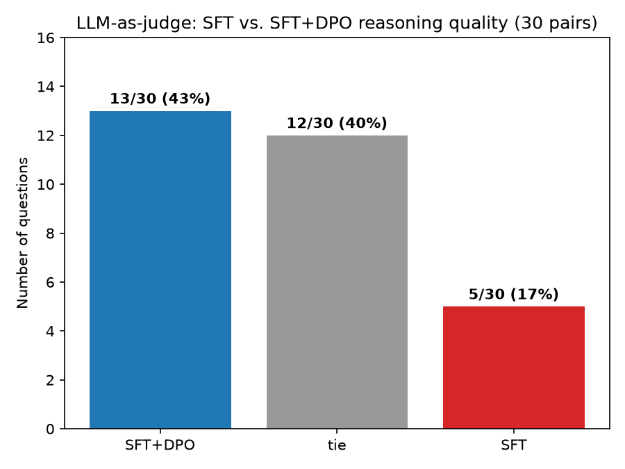
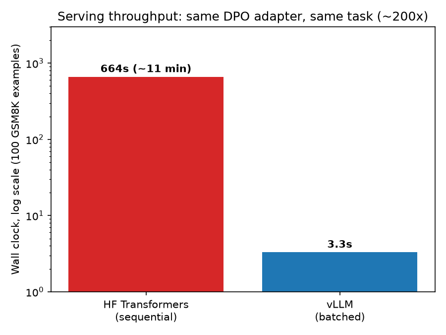

# OpenPostTrain

An end-to-end LLM post-training project: taking a small base model with essentially zero task ability and, through a documented sequence of SFT, DPO, RL (GRPO), and an LLM-as-judge evaluation, building measurable reasoning capability on GSM8K math word problems -- then serving the result through a production inference stack (vLLM) and investigating a real correctness question that surfaced along the way.

Every stage below is driven by versioned YAML configs and reproducible scripts, with the reasoning behind each decision (including two honestly-reported null/negative results) written up in [`DECISIONS.md`](DECISIONS.md).

## Headline Result

| Stage | Accuracy (GSM8K, 100-example test split) |
|---|---:|
| Base model, zero-shot | 0.03 |
| + Supervised fine-tuning (LoRA) | 0.32 |
| + Direct Preference Optimization | 0.51 |
| + GRPO (online RL) | 0.52 |

The raw base model barely attempts the task (it mostly degenerates into repeating a junk token). Each subsequent stage is a real, controlled, documented improvement over the last -- see [Failure-Type Breakdown](#failure-type-breakdown) for *how* it improved, not just the headline number.

## Contents

- [Architecture](#architecture)
- [What This Project Demonstrates](#what-this-project-demonstrates)
- [Setup](#setup)
- [Stage 1: Baseline Evaluation](#stage-1-baseline-evaluation)
- [Stage 2: Supervised Fine-Tuning](#stage-2-supervised-fine-tuning)
- [Stage 3: DPO](#stage-3-dpo-on-the-sftd-model)
- [Stage 4: LLM-as-Judge](#stage-4-llm-as-judge-evaluation)
- [Stage 5: GRPO (RL)](#stage-5-grpo-rl)
- [Stage 6: Serving / Inference Comparison](#stage-6-servinginference-comparison-vllm-vs-hf-transformers)
- [Project Status](#project-status)
- [Development & Testing Utilities](#development--testing-utilities)

## Architecture

Each arrow is a real training/serving stage with its own config, script, and documented result below. Same GSM8K evaluator and failure-type taxonomy (`correct` / `wrong_numeric_answer` / `no_numeric_answer` / `format_violation`) is reused throughout, so every stage is directly comparable to every other.

## What This Project Demonstrates

Beyond "accuracy went up," a few things worth calling out for anyone skimming this:

- **Knowing when fine-tuning hurts, not just when it helps.** Fine-tuning the already-instruction-tuned model regressed accuracy across four diagnostic rounds ([Stage 2](#stage-2-supervised-fine-tuning)) -- documented as a real negative result, not hidden. Fine-tuning the base model instead was the actual fix.
- **Catching and correcting your own mistake.** A later retrain of the "headline" SFT result landed 5 points lower than originally reported, due to GPU training non-determinism -- the DPO comparison was re-derived and corrected in the docs rather than left wrong ([Decision 024](DECISIONS.md)).
- **Reporting a null result honestly instead of chasing a number.** Two independently-tuned GRPO configs (10x learning rate, 3x epochs apart) converged on the *exact same* result -- reported as a real plateau, not spun as a partial win ([Stage 5](#stage-5-grpo-rl)).
- **Not trusting a surprising number until it's explained.** Switching inference backend to vLLM unexpectedly changed accuracy by 14 points. Investigated rather than reported at face value -- ruled out a real bug (wrong tokenizer), then diffed individual completions to find the actual cause: kernel-level floating-point differences interacting with a known degenerate-generation failure mode ([Stage 6](#stage-6-servinginference-comparison-vllm-vs-hf-transformers)).

## Setup

Create and activate a virtual environment:

    python3 -m venv .venv
    source .venv/bin/activate

Install dependencies:

    python -m pip install --upgrade pip
    python -m pip install -r requirements.txt

GPU-heavy stages (SFT, DPO, GRPO, vLLM serving) were run on a RunPod RTX 3090; evaluation, data prep, plotting, and the LLM-judge stage run fine on a CPU-only machine.

## Stage 1: Baseline Evaluation

Config-driven GSM8K evaluation pipeline. A tiny model (`sshleifer/tiny-gpt2`) is used for smoke-testing the pipeline without downloading large models -- see [Development & Testing Utilities](#development--testing-utilities).

The real baseline:

- Model: `Qwen/Qwen2.5-1.5B-Instruct`
- Benchmark: GSM8K, test split, first 100 examples
- Hardware: RunPod RTX 3090
- Prompt: `prompts/gsm8k_v1.txt`
- Generation: deterministic, `temperature=0.0`

    PYTHONPATH=src python scripts/run_eval.py --config configs/eval_gsm8k_qwen2_5_1_5b_512.yaml

| Model | Max New Tokens | Accuracy |
|---|---:|---:|
| Qwen2.5-1.5B-Instruct | 256 | 0.43 |
| Qwen2.5-1.5B-Instruct | 512 | 0.70 |

The 256-token run was heavily affected by truncation; the 512-token run is the baseline used for the Instruct-model comparisons below. (The base, non-instruct model used for the main post-training arc starts from a much lower 0.03 -- see Stage 2.)

Failure types recorded for every example: `correct`, `no_numeric_answer`, `format_violation`, `wrong_numeric_answer`. Inspect any run's failures with:

    python scripts/inspect_latest_failures.py --benchmark gsm8k --limit 15
    python scripts/compare_failure_types.py --benchmark gsm8k

## Stage 2: Supervised Fine-Tuning

Two tracks, run in parallel to compare *when* SFT helps vs. hurts.

### Track A: Instruct model (regression, documented)

Fine-tuning the already-instruction-tuned `Qwen2.5-1.5B-Instruct` only ever regressed accuracy, across four diagnostic rounds (overfitting fix, data scale-up + gentler LoRA, precision control, full-dataset scale-up):

    PYTHONPATH=src python scripts/prepare_gsm8k_sft_data.py --config configs/data_gsm8k_sft_small.yaml
    python -m pip install peft trl   # RunPod only
    PYTHONPATH=src python scripts/train_sft_lora.py --config configs/train_sft_qwen2_5_1_5b_gsm8k.yaml
    PYTHONPATH=src python scripts/run_eval.py --config configs/eval_gsm8k_qwen2_5_1_5b_sft.yaml

| Experiment | Train examples | Eval dtype | Accuracy |
|---|---:|---|---:|
| Baseline | - | fp16/bf16 | 0.70 |
| v1 | 200 | fp16 | 0.45 |
| v2 | 1500 | bf16 | 0.55 |
| v3 | 7000 | bf16 | 0.57 |

Data quantity clearly hit diminishing returns (1500 -> 7000 examples only gained +2pts) -- more data alone couldn't close the gap. Full diagnostic history in `DECISIONS.md` (Decision 020).

### Track B: Base model (headline success)

Fine-tuning `Qwen/Qwen2.5-1.5B` (base, non-instruct) instead -- a model with no existing GSM8K ability to overwrite:

    PYTHONPATH=src python scripts/prepare_gsm8k_sft_data.py --config configs/data_gsm8k_sft_full.yaml
    PYTHONPATH=src python scripts/train_sft_lora.py --config configs/train_sft_qwen2_5_1_5b_base_gsm8k.yaml
    PYTHONPATH=src python scripts/run_eval.py --config configs/eval_gsm8k_qwen2_5_1_5b_base_sft.yaml

| Run | Correct | no_numeric_answer | format_violation | wrong_numeric_answer | Accuracy |
|---|---:|---:|---:|---:|---:|
| Base zero-shot | 3 | 25 | 0 | 72 | 0.03 |
| Base zero-shot + reppen | 0 | 76 | 23 | 1 | 0.00 |
| Base + SFT + reppen | 1 | 14 | 53 | 32 | 0.01 |
| **Base + SFT, no reppen** | **37** | 10 | 1 | 52 | **0.37** |

A real, dramatic, qualitative improvement -- from a model that doesn't attempt the task at all to one that reliably formats answers and mostly reasons correctly. Two real bugs found and fixed along the way (a PEFT/tied-embeddings crash, and a repetition-penalty setting that was accidentally sabotaging the fine-tuned model's eval) -- full path in `DECISIONS.md` (Decision 021).

**Correction**: a later independent retrain of this same recipe evaluated to **0.32**, not 0.37, despite identical settings and seed -- GPU training isn't bit-reproducible run-to-run. 0.32 is the correct "before" number for the DPO comparison in Stage 3, since that's the actual adapter DPO continued from. See `DECISIONS.md` (Decision 024) for the full non-determinism writeup.

Both tracks are documented (Instruct: regression, Base: success) -- together they show *when* SFT helps vs. hurts, which is the stronger interview story than a single clean win.

## Stage 3: DPO on the SFT'd Model

Continues the SFT adapter with preference tuning, using on-policy pairs generated from the SFT'd model's own completions -- for training questions it gets wrong, `chosen` = gold reasoning, `rejected` = its actual wrong completion:

    PYTHONPATH=src python scripts/prepare_gsm8k_dpo_data.py --config configs/data_gsm8k_dpo.yaml
    PYTHONPATH=src python scripts/train_dpo.py --config configs/train_dpo_qwen2_5_1_5b_gsm8k.yaml
    PYTHONPATH=src python scripts/run_eval.py --config configs/eval_gsm8k_qwen2_5_1_5b_base_dpo.yaml

| Run | Correct | no_numeric_answer | format_violation | wrong_numeric_answer | Accuracy |
|---|---:|---:|---:|---:|---:|
| Base zero-shot | 3 | 25 | 0 | 72 | 0.03 |
| Base + SFT (actual DPO ancestor) | 32 | 17 | 2 | 49 | 0.32 |
| **Base + SFT + DPO** | **51** | 10 | 3 | 36 | **0.51** |

A real, controlled **+19-point** improvement (0.32 -> 0.51), on *both* fronts: `wrong_numeric_answer` dropped 49 -> 36 (fixed genuine close-but-wrong reasoning) and `no_numeric_answer` dropped 17 -> 10 (fewer degenerate-loop generations too). Training dynamics were also notably healthier than any SFT run: `eval_loss` decreased monotonically across all 3 epochs with no overfitting. Full detail in `DECISIONS.md` (Decision 022).

### Failure-Type Breakdown

*(Includes GRPO, covered in Stage 5. Regenerate all charts with `PYTHONPATH=src python scripts/plot_results.py`.)*

## Stage 4: LLM-as-Judge Evaluation

Pairwise comparison using Claude as a judge, instead of exact-match string parsing -- reads two eval runs' `results.csv` files and asks Claude which candidate's reasoning is better for each matching question. Runs entirely on the Mac, no GPU needed.

    export ANTHROPIC_API_KEY=sk-ant-...   # or put it in .env (see .env.example)
    PYTHONPATH=src python scripts/run_llm_judge.py \
      --run-a path/to/sft_run/results.csv --label-a "SFT" \
      --run-b path/to/dpo_run/results.csv --label-b "SFT+DPO" \
      --limit 30 \
      --output reports/judge_sft_vs_dpo.csv

Judge model is Claude Opus 4.8 by default (`--model` to override) -- see `DECISIONS.md` (Decision 023) for the cost/quality reasoning.

| Winner | Count | Rate |
|---|---:|---:|
| SFT+DPO | 13 | 43.3% |
| SFT | 5 | 16.7% |
| tie | 12 | 40.0% |

Confirms the exact-match accuracy gain (0.32 -> 0.51) qualitatively, via a completely independent grading method: DPO wins on reasoning quality far more often than it loses. See `DECISIONS.md` (Decision 025).

## Stage 5: GRPO (RL)

SFT and DPO above are both *offline*: trained against a fixed dataset built once ahead of time. GRPO is *online* RL -- the model generates a completion live during training, a reward function grades it immediately, and the policy updates from that score. Continues the DPO adapter; reward functions reuse the existing GSM8K evaluator's answer-extraction logic directly rather than new grading code. See `DECISIONS.md` (Decision 026) for the full design.

    PYTHONPATH=src python scripts/prepare_gsm8k_grpo_data.py --config configs/data_gsm8k_grpo.yaml
    PYTHONPATH=src python scripts/train_grpo.py --config configs/train_grpo_qwen2_5_1_5b_gsm8k.yaml

Two configs tried -- v1 (conservative: `lr=1e-6`, 1 epoch) and v2 (`lr=1e-5`, 3 epochs) -- both continuing the same DPO adapter over the same 500 training prompts:

| Run | Correct | no_numeric_answer | format_violation | wrong_numeric_answer | Accuracy |
|---|---:|---:|---:|---:|---:|
| Base + SFT + DPO | 51 | 10 | 3 | 36 | 0.51 |
| Base + SFT + DPO + GRPO v1 | 52 | 11 | 1 | 36 | 0.52 |
| Base + SFT + DPO + GRPO v2 | 52 | 11 | 1 | 36 | 0.52 |

v1's +1 point is within the ~5-point run-to-run noise already established for this eval (see Stage 2's non-determinism finding) -- statistically flat, not an improvement. v2 (10x the learning rate, 3x the epochs) landed on the **exact same failure-type breakdown as v1**, despite genuinely more policy movement during training (KL an order of magnitude larger, in-training validation reward climbing to 0.58 vs. v1's 0.52) -- that extra movement didn't transfer to the held-out benchmark at all.

Read together, these two runs are stronger evidence of a real plateau than either alone: training itself works correctly end-to-end (the online generate-grade-update loop, stable reward/KL, no collapse in either run) -- this DPO-then-GRPO recipe just isn't moving this particular eval further within the LR/epoch range tried. Full analysis in `DECISIONS.md` (Decisions 027-028).

## Stage 6: Serving/Inference Comparison (vLLM vs. HF Transformers)

A different competency than the training stages above: how the same trained adapter behaves under a production-oriented serving stack instead of the naive HF Transformers loop used for every eval so far.

    PYTHONPATH=src python scripts/run_eval_vllm.py --config configs/eval_gsm8k_qwen2_5_1_5b_base_dpo_vllm.yaml

Same DPO adapter, same 100 GSM8K test questions, same greedy-decoding parameters, same evaluator:

| Backend | Accuracy | Wall clock (100 examples) |
|---|---:|---:|
| HF Transformers (sequential) | 0.51 | ~11 min |
| vLLM (single batched call) | 0.65 | ~3 sec |

**Throughput**: ~200x, the expected result of continuous batching vs. a one-request-at-a-time loop.

**Accuracy**: the +14-point gap was not expected, and is well outside this eval's established ~5-point noise band. Investigated rather than reported at face value:

1. Suspected a tokenizer bug -- vLLM defaulted to the base model's tokenizer instead of the adapter's. Real bug, fixed, but didn't change the result.
2. Diffed all 100 completions between backends. Finding: vLLM produced **zero** degenerate/malformed completions on this eval, while HF Transformers produced 13 -- including the exact repetition-loop failure mode from Stage 2 (one HF completion was the token `afone` repeated ~90 times; vLLM's completion for the identical question was a clean, correct solution). Where vLLM *was* wrong, it was a genuine reasoning slip, not garbage.

Conclusion: same weights, same LoRA adapter, same greedy decoding -- but different attention/LoRA kernels between the two backends produce numerically different logits, and greedy decoding's autoregressive nature means any early divergence cascades through the whole completion. Same non-determinism principle as Stage 2's training finding, now shown to apply at inference time between serving stacks too. Full analysis in `DECISIONS.md` (Decisions 029-030).

## Project Status

The full arc -- baseline -> SFT (two tracks) -> DPO -> LLM-as-judge -> GRPO -> serving comparison -- is complete and documented end to end, including two honestly-reported null/negative results (the Instruct-model SFT regression, and the GRPO plateau) and one resolved surprise (the vLLM correctness investigation). Every claim in this README traces back to a decision entry in [`DECISIONS.md`](DECISIONS.md) with the full reasoning, not just the final number.

Remaining optional idea, not started: synthetic/self-distilled data generation to push GSM8K accuracy further. Not required for the project to be complete -- the post-training stack above (eval design, SFT, DPO, RL, LLM-judge, serving) already covers the full arc it set out to demonstrate.

## Development & Testing Utilities

Reference commands used throughout development, not part of the main narrative above.

### Smoke Test

A tiny model (`sshleifer/tiny-gpt2`) for testing the pipeline without downloading large models:

    PYTHONPATH=src python scripts/run_eval.py --config configs/eval_gsm8k_tiny.yaml

Loads `sshleifer/tiny-gpt2`, evaluates 3 GSM8K examples, saves `summary.json` + `results.csv`. Not expected to achieve meaningful accuracy.

A small instruction-tuned model is also available for testing instruction-following without the full-size models:

    PYTHONPATH=src python scripts/run_eval.py --config configs/eval_gsm8k_smollm2_135m.yaml

### Leaderboard

Every evaluation run appends a summary row to `results/leaderboard.csv` (model name, benchmark, split, accuracy, config path, output directory, and now serving backend/throughput). Local-only -- `results/` is gitignored.

### Inspect Failures

    python scripts/inspect_failures.py --results path/to/results.csv --limit 5
    python scripts/inspect_latest_failures.py --benchmark gsm8k --limit 3

Helps identify whether failures come from model reasoning, prompt formatting, or answer extraction.

### Compare Runs, Failure Types, and Prompts

    python scripts/compare_runs.py --benchmark gsm8k
    python scripts/compare_failure_types.py --benchmark gsm8k
    python scripts/compare_prompts.py --benchmark gsm8k --model-name HuggingFaceTB/SmolLM2-135M-Instruct

### Generate Experiment Report

    python scripts/generate_experiment_report.py --benchmark gsm8k --output reports/gsm8k_report.md

### Prompt Templates

Stored under `prompts/` (currently `gsm8k_v1.txt`, `gsm8k_v2_strict.txt`). Evaluation configs select one via `prompt_path`.

### Generation Settings

Evaluation configs set generation parameters directly:

    max_new_tokens: 512
    temperature: 0.0
    top_p: 1.0

Deterministic (`temperature=0.0`) generation is used throughout for reproducible benchmark comparisons.
